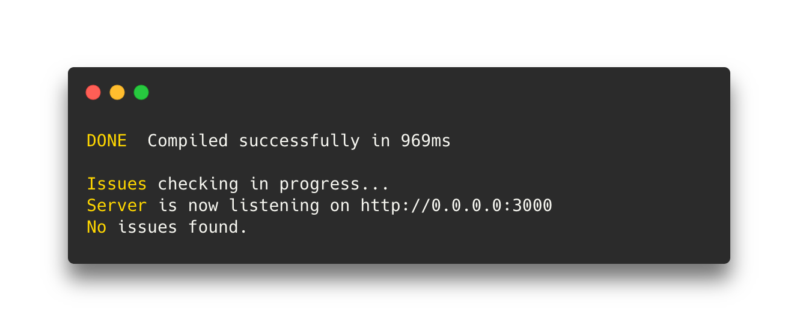

<div align="center">

<h1>Cartable</h1>
<p>A fast, zero-config toolkit to develop node.js applications.</p>

[](https://www.npmjs.com/package/@cartable/core)

</div>

Cartable aims to provide you the best DX to develop your node.js applications. It's focused on server-only applications. Heavily inspired by [backpack](https://github.com/jaredpalmer/backpack), the idea is a zero-config tool so you don't have to spend hours to configure your project for the tenth time. You can use it for new apps as well as existing ones.

## Features

- [TypeScript](https://github.com/microsoft/TypeScript) support out of the box
- Fast, using [swc](https://github.com/swc-project/swc) to transpile the code
- Great DX, readable error messages, live reloading etc
- Zero-config, one dependency
- Easily customizable

## Documentation

- [Installation](#installation)
- [Usage](#usage)
  - [Using in development](#using-in-development)
  - [Building for Production](#building-for-production)
- [Configuration](#configuration)
  - [Customizing webpack config](#customizing-webpack-config)
  - [Customizing swc config](#customizing-swc-config)
- [Commands](#commands)
  - [`cartable dev`](#cartable-dev)
  - [`cartable build`](#cartable-build)
- [Inspiration](#inspiration)
- [License](#license)

## Installation

Install the package:

```sh
# with npm
npm install --save-dev @cartable/core

# with yarn
yarn add --dev @cartable/core

# with pnpm
pnpm add --save-dev @cartable/core
```

Add the cartable scripts to your package.json like this:

```json
{
  "scripts": {
    "dev": "cartable",
    "build": "cartable build"
  }
}
```

## Usage

### Using in development

Run the dev command that will reload your server when you edit:

```
npm run dev
```

Successful builds will show a console like this. _Note: screenshot taken from running the [basic typescript example](https://github.com/pradel/cartable/tree/master/examples/basic-typescript)._



### Building for Production

Run the build command and start your app:

```bash
npm run build
node ./dist/index.js
```

## Configuration

### Customizing webpack config

To extend webpack, you can define a function that extends its config via `cartable.config.js`.

```js
// cartable.config.js
module.exports = {
  webpack: (config) => {
    // Perform customizations to config
    // Important: return the modified config
    return config;
  },
};
```

### Customizing swc config

To extend our usage of `swc`, you can define a `.swcrc` file at the root of your app. This file is optional.

If found, cartable will consider it to be the _source of truth_.

Here's an example `.swcrc` file:

```json
{
  "jsc": {
    "target": "es2020",
    "parser": {
      "syntax": "typescript"
    }
  }
}
```

## Commands

### `cartable dev`

Runs cartable in development mode.
Your code will reload if you make edits.

### `cartable build`

Builds the app for production to the `dist` folder.
It correctly bundles your production mode and optimizes the build for the best performance.

You can run your production application with the following command:

```sh
node ./dist/index.js
```

## Inspiration

- [jaredpalmer/backpack](https://github.com/jaredpalmer/backpack) - [jaredpalmer/backpack](https://github.com/jaredpalmer/backpack) - First version of Cartable is a modified version of backpack.
- [zeit/next.js](https://github.com/zeit/next.js)

## License

MIT License © [Léo Pradel](https://www.leopradel.com/)
